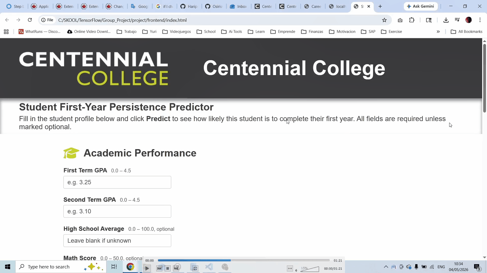
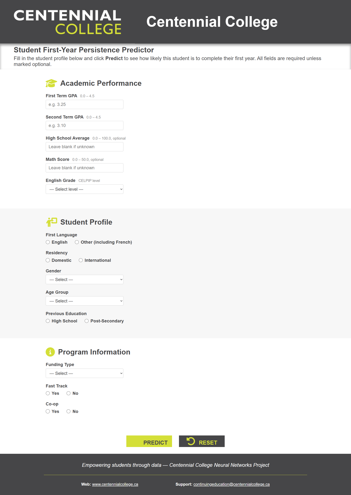
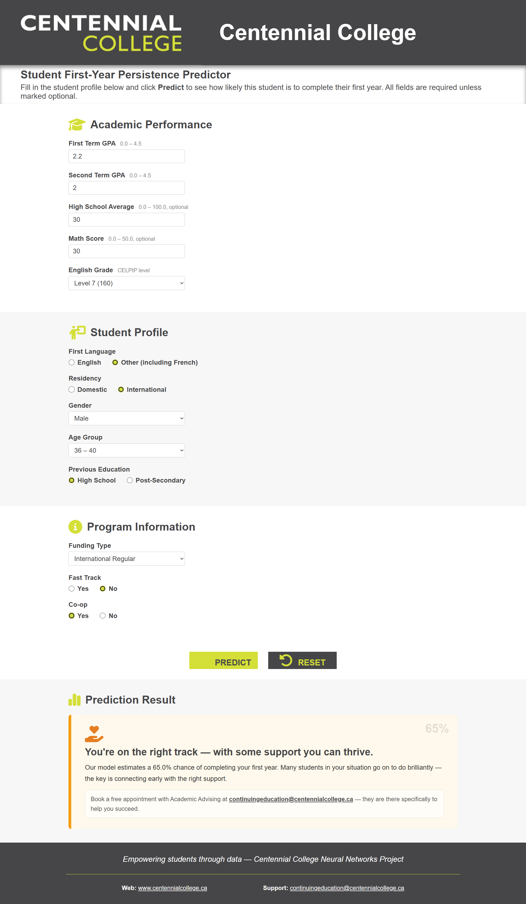
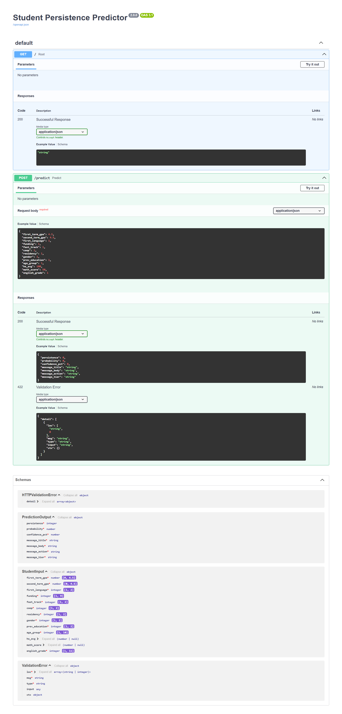

#  Student Persistence Predictor
### AI-Powered Early Intervention System for Student Success

<p align="center">


</p>

---

##  Project Overview

Student dropout is one of the biggest challenges faced by academic institutions.

This project uses **Artificial Intelligence**, **Neural Networks**, and **real student academic data** to identify students who may require academic support during their first year.

Instead of waiting until students fail, this system enables **early intervention**, helping advisors connect students with support resources before small obstacles become bigger problems.

Developed independently as part of my Software Engineering + Artificial Intelligence journey.

---

#  Live Demo

<p align="center">
  
</p>

---

#  Application Screenshots

## Main Interface



## High Confidence Prediction


## Medium Risk Prediction



## Early Support Alert


---

#  System Architecture

<p align="center">
  
</p>

---

#  Machine Learning Highlights

This solution was developed through **32 neural network experiments** to identify the best architecture and classification threshold. :contentReference[oaicite:1]{index=1}

### Final Model Performance

| Metric | Result |
|--------|--------|
| F1 Score (Dropout) | 0.867 |
| ROC AUC | 0.937 |
| Threshold | 0.70 |
| Model Type | Binary Neural Network |
| Framework | TensorFlow / Keras |

---

#  Features

- Real-time student risk prediction  
- REST API architecture  
- Input validation  
- Feature engineering pipeline  
- Missing-value imputation  
- Threshold tuning  
- Personalized intervention messages  
- Risk-based confidence scoring  
- Responsive frontend experience  

---

#  Frontend

Built using:

- HTML5
- CSS3
- Vanilla JavaScript
- Font Awesome

Features:

- Live form validation
- Loading animation
- Dynamic feedback cards
- Risk-tier visual alerts
- Smooth scrolling UX

---

#  Backend

Built using:

- :contentReference[oaicite:2]{index=2}
- :contentReference[oaicite:3]{index=3}
- :contentReference[oaicite:4]{index=4}
- NumPy
- Joblib

### Backend Responsibilities

- Input validation
- Feature transformation
- Standardization
- One-hot encoding
- KNN imputation
- Neural network inference
- Threshold classification
- Personalized recommendations

---

#  API Documentation

Interactive API available through:

```txt
http://127.0.0.1:8000/docs
```

## Swagger UI



Powered by:

:contentReference[oaicite:5]{index=5}

---

#  Local Installation

## Clone repository

```bash
git clone https://github.com/OsirisCR/Student_Persistence.git
cd Student_Persistence
```

## Create virtual environment

```bash
python -m venv .venv
```

## Activate environment

### Windows

```bash
.venv\Scripts\activate
```

### Linux / Mac

```bash
source .venv/bin/activate
```

## Install dependencies

```bash
pip install -r requirements.txt
```

---

#  Run Backend

```bash
uvicorn backend.predict:app --reload --port 8000
```

Backend:

```txt
http://127.0.0.1:8000
```

---

#  Run Frontend

Simply open:

```txt
frontend/index.html
```

in your browser.

---

#  Data Privacy

Due to academic privacy requirements, the original dataset is not included in this repository.

All models were trained using anonymized institutional data.

---

#  Business Impact

This project demonstrates how AI can:

- Identify at-risk students early
- Improve retention rates
- Enable proactive interventions
- Support academic advisors
- Improve institutional decision making

---

#  Future Improvements

- Cloud deployment
- Authentication
- Model monitoring
- Explainable AI dashboards
- SHAP feature importance
- Docker containerization
- CI/CD pipeline
- Database integration

---

#  About the Author

**Tyler Durden (OsirisCR)**

Software Engineer | AI Developer | Solutions Architect

Background:

- 10+ years in enterprise software
- SAP Technical Consulting
- Software Engineering + Artificial Intelligence

Passionate about building technology that creates real human impact.

GitHub:


---

#  If you found this project interesting...

Please consider giving it a star ⭐

It helps others discover the project and supports my journey in AI engineering.
